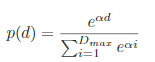

<h1> Lichess Degrees of Separation</h1>

<h2> Overview</h2>

The Chess Degrees of Separation project calculates the "degrees of separation" between players on the popular chess site lichess.com. The goal is to find a path with a chain of wins from a starting player to the top player to show how a user has "beaten" the top player. This concept is inspired by the paper "Degrees of Separation in Social Networks" which finds the degrees of connection of twitter users based on mutual friends. 

<h2>Algorithm</h2>

The project uses a probabilistic bidirectional search algorithm that does not strictly enforce a breadth first constraint and instead prioritizes expanding nodes of low depth while occasionally taking greedy steps. The following formula considers all current expanded node depths and probabilistically determines which depth of node to expand next.



This project used a decay parameter (alpha) of -1 as opposed to the twitter algorithm's decay parameter of -2. an alpha of -1 increases the chance of greedy steps favoring nodes of higher depth slightly more than a decay parameter of -2. When a node depth is chosen, nodes of that depth are sorted by their player ranking. This heuristic is based on the assumption that ranking is correlated with player skill and higher rated players are going to be more likely to be matched with and beat the highest rated players and thus a shorter distance away from the eventual top rated player. \
\
Using the Lichess public API limits the number of games we can download per ip address to just 20/s. We chose to download just the 200 most recent games per player for a total of 10s to expand each node. Although 200 games are downloaded, the lichess public API doesn't have a convenient way to only download wins or losses meaning over half of our 20 games a second will be wasted to draws or losses.


```python
import pandas
lst = [(5, '462.65', 45, 8952, ['VxxSUJXh', 'BfGC5heL', 'BhRWx4Xw', '71iAZQeC', '70Gjah7L']), (4, '341.09', 33, 6600, ['azbQLmZM', 'gdEIEmfL', 'NRFBhar0', '2QQHmcnC']), (7, '1444.47', 142, 27850, ['AbPj0Yvs', 'vXwWniQm', 'AjrPXQMm', 'SCHgkbj8', '5nVPua2c', 'pgMZoC6p', 'kHzZLMXD']), (4, '463.41', 45, 8952, ['6MbS3Bu2', 'JuueMO0B', 'WtidaK0x', 'wxGU9kgC']), (6, '325.55', 32, 6219, ['Wgl8iD6U', 'Er5za1PA', 'pyj2WyO0', 'HuahfbiR', 'Cu1tYeFz', 'b5lfRyVA']), (5, '458.05', 44, 8800, ['vIY47btF', 'f319CyWD', 'bKvGu7EK', '27HDtUDv', 'b5lfRyVA']), (5, '183.56', 18, 3545, ['7BU7ZszI', '3JQYqdCZ', 'ht0n6xbk', 'vN8ck1Oi', 'jOMUHlUr']), (5, '512.19', 51, 9856, ['6MbS3Bu2', 'b5G0bvHO', 'aP9Kn7Y4', 'q0LxW7Na', 'JlzLz1VT']), (7, '549.54', 53, 10600, ['WFG7GvQf', '8mW6XAAv', '00vtNamV', 'qTi3nDlr', 'vAne0m3H', 'KD2xFmMf', 'EJGuzlRY']), (6, '473.14', 43, 8079, ['WFG7GvQf', '8mW6XAAv', 'XQkohSiP', 'qoEjIUpR', 'WvaZATBU', 'QfO3FuqF']), (5, '206.70', 20, 4000, ['06NusvNP', 'kqhLvqJw', 'zDNRRZCg', 'uZGotwHH', 'b5lfRyVA']), (6, '747.80', 73, 14408, ['Y11Nej4q', 'DyXecVKW', 'cfvjOgpW', 'YZOQA4Iu', 'ofvnBOj7', 'prWUXogW']), (6, '1121.09', 109, 21650, ['34EL7aen', 'RxvQveaV', 'eolwR0ww', 'VVUEFXNl', 'XHyuOu7E', '2QQHmcnC']), (6, '534.66', 52, 10352, ['Jgms4A1T', 'Z4ut8res', '47LKp04J', 'xJiRs20I', 'YvwkP1LK', '2QQHmcnC']), (6, '583.54', 58, 11184, ['fCnH3j5e', '0urjhulW', 'hwi8Qy7x', '9OP2m7l0', '5rnadTEk', 'Q6EIBNtI']), (6, '261.00', 25, 5000, ['b5lfRyVA', 'YcMrA9Va', 'o6auHNu5', '7sGZaM0v', 'gdBYV8WF', 'MufgGwDb']), (6, '1199.57', 124, 22668, ['fsjVmC0S', '30ufL5wi', 'cOpRttlK', 'jHLoZv33', '8mW6XAAv', 'WFG7GvQf']), (6, '1076.46', 106, 20409, ['5vwsRYIA', 'Ooc57mRn', 'ScNAfdPt', 'NLnHqrh5', 'tnrJWMlJ', 'oXd5iwcd']), (6, '425.15', 43, 8098, ['6MbS3Bu2', 'b5G0bvHO', 'jDheFZv5', '4I3yXc4w', 'N2UB6QDi', 'pz3E9Lb1']), (5, '747.10', 73, 14330, ['NdYThwAU', 'SjjC6488', 'aujtDB06', 'XYY6U6vx', 'B7eAm5CS']), (6, '406.25', 39, 7782, ['6MbS3Bu2', 'yPfs4fc0', 'zTzaUDai', '9A78G5i2', 'lDna5Ocy', 'XyBd0Q9w']), (7, '1880.72', 188, 35929, ['OBRYPiJ0', '8uGQVdjM', 'am9gCnVa', 'Y34Mn4rq', 'odUUiWQx', 'EF6hsyKs', 'VxxSUJXh']), (7, '1910.09', 186, 35670, ['gGYTytk3', 'nozIJcug', 'lK8FskD5', 'KZfdg0mJ', 'CzL8kDpN', '52ITtJbQ', 'PgwxbdCX']), (8, '827.26', 87, 15514, ['B7eAm5CS', 'ZWXezYe7', 'Vy9wxXJ7', 'PBsJYWLI', 'XV8WLIY2', 'g1ijuVVP', 'yHcTgysn', 'IBcckXse']), (6, '1362.64', 134, 25837, ['5vwsRYIA', 'jnE8HA8H', 'KSIhWcZZ', 'BYomuhnC', 'GtKjdQcR', 'yLUsiIg8']), (6, '517.11', 50, 10000, ['CIUIr6mE', 'rvicAQYs', 'r1fJfDDw', '1BDtZsdK', 'Crc0nzwW', 'b5lfRyVA']), (6, '831.24', 82, 16051, ['gsU9WcU2', 'hgFhddlS', 'zvDa0z3u', 'VlCeEFpD', 'YCSJeJcA', '2QQHmcnC']), (4, '103.97', 10, 2000, ['2QQHmcnC', 'YCSJeJcA', 'ilDkyw8o', '0Vw2E95R']), (6, '259.12', 26, 4922, ['Vi7obTSJ', 'hZcojKRe', 'CHdbUHC5', 'mc2Hl99K', 'vmRffo3K', 'b5lfRyVA']), None, (5, '428.87', 42, 8139, ['S8DtH4L5', '8nZdGVQS', 'VmYDX7Dr', 'YCSJeJcA', '2QQHmcnC']), (6, '255.72', 28, 4902, ['YXIJSGK4', 'DThnIJqQ', 'IpPz9fsf', 'SU6He0S5', 'YcMrA9Va', 'b5lfRyVA']), None, (7, '857.48', 87, 16399, ['WpPVOEw4', 'ZBZWsdMi', 'lmMQvxHI', 'pOXPdnPh', 'W7q2xEcf', 'C33eGI0m', 'fCnH3j5e']), None, (5, '1671.93', 167, 32177, ['sHOOQID2', 'ylhlhTDp', 'PyeVTBy8', 'pgMZoC6p', 'kHzZLMXD']), None, (4, '299.18', 29, 5733, ['btGjwSpN', 'IJCxCitq', 'S40HhK5u', 'B7eAm5CS']), (6, '1074.38', 106, 20422, ['5vwsRYIA', 'Ooc57mRn', 'ScNAfdPt', 'NLnHqrh5', 'tnrJWMlJ', 'oXd5iwcd']), (7, '926.20', 93, 17752, ['fCnH3j5e', 'mJA43MjJ', 'SgF9IjQK', 'aHgmUMNR', 'hwhZwScP', 'wjtVFdsq', '3LnlrRYl']), (4, '155.11', 15, 2978, ['B7eAm5CS', 'XPZ2JiNM', 'bTDVF0ik', 'apkAVqT8']), (6, '266.17', 27, 5095, ['awjbcbsu', 'XUv9bMcv', 't25WXJQu', 'mxoQa7fP', '0sP7isTx', 'b5lfRyVA']), (5, '144.77', 14, 2800, ['y0xY9OAr', 'WObBZ9DE', 'bLnh4Xd7', 'sGu63GZQ', 'LcswpFh4']), (8, '684.48', 71, 12352, ['zS6sploY', 'SjWDHKEJ', 'bhne8aux', 'QBGlVdRH', 'm2ARtV7J', 'lbMeWggx', 'XJejNctT', 'fCnH3j5e']), (6, '1157.55', 113, 22184, ['B7eAm5CS', '7ccTUqys', 'xinj7d28', 'wycirxKi', 'XMz70LLb', 'k8Mi5Mdr']), (8, '923.58', 90, 17711, ['VxxSUJXh', 'EF6hsyKs', 'odUUiWQx', 'd2mjwvQt', 'koHwnUs9', 'CmTuaM3A', 'JRcl8O2y', 'lY7NRmgX']), (7, '768.16', 77, 14603, ['kHzZLMXD', 'pgMZoC6p', 'RMcvfKC0', '1jnlCNSw', 'BMgDUcaq', '1OoBhqki', '4RB4o2qS']), (6, '2196.39', 224, 41913, ['EYr99Byo', '4fyAgeNI', 'ObIbRjn1', 'li54JNJX', 'XYY6U6vx', 'B7eAm5CS']), (6, '628.82', 64, 12065, ['6MbS3Bu2', 'CLddf0Bh', 'EKQWuyOV', '5FJEVzAh', 'khZnkshN', 'l0DhQX1v']), (7, '1904.63', 190, 36329, ['OBRYPiJ0', '8uGQVdjM', 'am9gCnVa', 'Y34Mn4rq', 'odUUiWQx', 'EF6hsyKs', 'VxxSUJXh']), (7, '503.89', 50, 9590, ['5vwsRYIA', 't2Wvi0rD', 'KfybSB9R', 'OLe4VAms', 'NtyxuOo6', 'aTHHtPA9', 'vpDXPXIg']), (7, '407.42', 39, 7800, ['YAm33IOk', 'tAiBDDP3', 'RmCfWDiv', 'hi8xhJbM', '8rmb8UHb', 'ghEji2s0', '2QQHmcnC']), (4, '872.40', 86, 16762, ['fCnH3j5e', 'bOwvduMZ', 'hGMR7M6A', 'pC09TUcX']), (6, '1270.72', 122, 23435, ['fCnH3j5e', 'mJA43MjJ', 'NnoHDAJN', 'CzL8kDpN', '52ITtJbQ', 'PgwxbdCX']), (4, '503.18', 49, 9668, ['fCnH3j5e', 'mJA43MjJ', 'PTocTGnv', 'DoiLZc5Z']), (5, '148.05', 14, 2800, ['5vwsRYIA', 't2Wvi0rD', 'FMjF7Mi1', 'LPS6Dlm4', 'FkNZAonL']), (6, '578.60', 57, 10897, ['B7eAm5CS', 'ZWXezYe7', 'Fiuntxor', 'T517GJT1', 'IQ5mnWXl', 'm0Y2eYV4']), (5, '465.94', 45, 9000, ['6MbS3Bu2', 'hFVzTCqJ', '1NTutVge', 'QFvlSRAv', 'DS76celi']), (5, '753.42', 75, 14507, ['fCnH3j5e', 'XJejNctT', '0ynMcrvD', 'EBYlBgon', '8UQyX9tq']), (6, '1302.55', 128, 24718, ['pZm0qB3k', 'd5Wy0wAq', 'OHkOJ9CG', 'p5TrRzis', 'mJA43MjJ', 'fCnH3j5e']), (6, '1560.57', 154, 29956, ['B7eAm5CS', 'ZWXezYe7', 'Fiuntxor', 'yIhRrvfk', '0c6NuOYG', 'vHyTQRdJ']), (7, '1875.74', 181, 35309, ['gGYTytk3', 'LYs8vudD', 'tgtjCWZd', 'HzbAnfNs', '2Fb5xa3f', '74IaH1IL', '95iPbKpC']), (5, '518.50', 50, 10000, ['o0rX1kou', 'NJW2clec', 'huIiOJbA', 'Zb0IsVVe', 'fCnH3j5e']), (7, '1438.75', 141, 27656, ['kHzZLMXD', 'pgMZoC6p', 'gj010UWW', 'hiNpj9Py', 'stIam3If', '7xNWdIou', 'u5zkG1EH'])]
lst = [x for x in lst if x is not None]
d = {"pathLength":[] , "time":[] , "apicalls":[], "gamesAnylized":[] }
for pathLength , time , apicalls, gamesAnylized , path in lst:
    d["pathLength"].append(pathLength )
    d["time"].append(float(time) )
    d["apicalls"].append(apicalls )
    d["gamesAnylized"].append(gamesAnylized)
df = pandas.DataFrame(d)
print(df)

```

        pathLength     time  apicalls  gamesAnylized
    0            5   462.65        45           8952
    1            4   341.09        33           6600
    2            7  1444.47       142          27850
    3            4   463.41        45           8952
    4            6   325.55        32           6219
    5            5   458.05        44           8800
    6            5   183.56        18           3545
    7            5   512.19        51           9856
    8            7   549.54        53          10600
    9            6   473.14        43           8079
    10           5   206.70        20           4000
    11           6   747.80        73          14408
    12           6  1121.09       109          21650
    13           6   534.66        52          10352
    14           6   583.54        58          11184
    15           6   261.00        25           5000
    16           6  1199.57       124          22668
    17           6  1076.46       106          20409
    18           6   425.15        43           8098
    19           5   747.10        73          14330
    20           6   406.25        39           7782
    21           7  1880.72       188          35929
    22           7  1910.09       186          35670
    23           8   827.26        87          15514
    24           6  1362.64       134          25837
    25           6   517.11        50          10000
    26           6   831.24        82          16051
    27           4   103.97        10           2000
    28           6   259.12        26           4922
    29           5   428.87        42           8139
    30           6   255.72        28           4902
    31           7   857.48        87          16399
    32           5  1671.93       167          32177
    33           4   299.18        29           5733
    34           6  1074.38       106          20422
    35           7   926.20        93          17752
    36           4   155.11        15           2978
    37           6   266.17        27           5095
    38           5   144.77        14           2800
    39           8   684.48        71          12352
    40           6  1157.55       113          22184
    41           8   923.58        90          17711
    42           7   768.16        77          14603
    43           6  2196.39       224          41913
    44           6   628.82        64          12065
    45           7  1904.63       190          36329
    46           7   503.89        50           9590
    47           7   407.42        39           7800
    48           4   872.40        86          16762
    49           6  1270.72       122          23435
    50           4   503.18        49           9668
    51           5   148.05        14           2800
    52           6   578.60        57          10897
    53           5   465.94        45           9000
    54           5   753.42        75          14507
    55           6  1302.55       128          24718
    56           6  1560.57       154          29956
    57           7  1875.74       181          35309
    58           5   518.50        50          10000
    59           7  1438.75       141          27656
    


```python
print(df.describe())
```

           pathLength         time    apicalls  gamesAnylized
    count    60.00000    60.000000   60.000000      60.000000
    mean      5.85000   779.304500   76.983333   14848.483333
    std       1.03866   527.611625   52.476142   10028.255991
    min       4.00000   103.970000   10.000000    2000.000000
    25%       5.00000   420.717500   41.250000    8009.250000
    50%       6.00000   581.070000   57.500000   11040.500000
    75%       6.25000  1087.617500  106.750000   20729.000000
    max       8.00000  2196.390000  224.000000   41913.000000
    


```python

```
